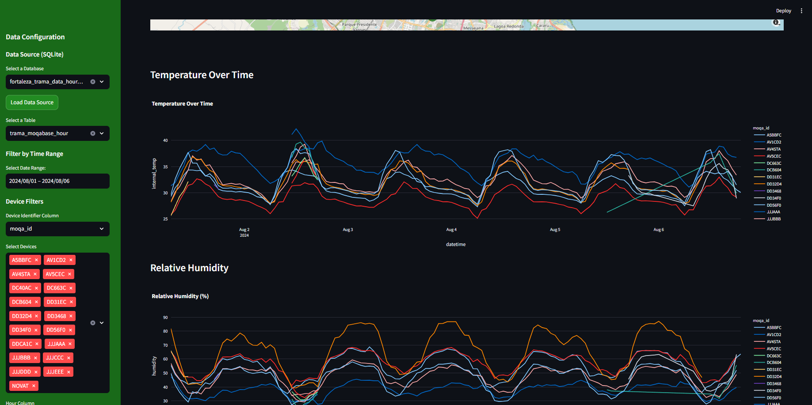
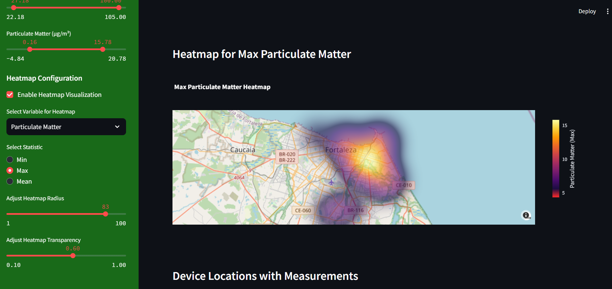

# Air Quality Brazil - Dashboard 🌎

This repository hosts tools and data for monitoring air quality in Brazil. The dashboard serves as a visualization hub by aggregating data from various air quality networks, supporting research and increasing public awareness of air pollution trends and solutions.

---

## 📊 About the Project

The **Air Quality Brazil Dashboard** is an interactive and dynamic platform built using **Streamlit** and **Plotly**. It provides visualizations such as **graphs, maps, and filters** to explore air quality data from different regions of Brazil.

This dashboard currently features **real data** from Fortaleza, Ceará, provided by the **MOQA Network** – a collaboration between:

- **TRAMA (Transport and Environment Laboratory)** – UFC (Federal University of Ceará)
- **CITINOVA** – Foundation for Science, Technology, and Innovation of Fortaleza
- **Fortaleza City Hall**

The data includes air quality records from **August 1, 2024, to August 6, 2024**. Future releases will include extended datasets and other regions of Brazil.

---

## 🚀 Features

### ✅ Completed
- **Initial Dashboard**: Interactive and user-friendly interface
- **Data Import**: SQLite databases can be loaded dynamically
- **Graphs**: Line charts for temperature, humidity, and particulate matter
- **Map**: Devices displayed on a map with geolocations
- **Filters**: Time range, device selection, and data thresholds

### 🔄 To Do
- **Import Additional Sources**: Integrate other air quality networks
- **Enhance Statistical Analysis**: Add in-depth statistics and summary insights
- **Implement New Visualizations**: Heatmaps, scatter plots, and advanced charts
- **Calculate AQI (Air Quality Index)**: Automatic AQI calculations in the dashboard

---

## 🗂️ Data

### Data Source
A sample **SQLite database** is available in the folder `data/air-quality-data`. It contains real air quality data from the **MOQA Network**, recorded in Fortaleza, Ceará, between **August 1, 2024, and August 6, 2024**. This database is for demonstration and development purposes.

### Adding Your Data
To use this dashboard with your data:
1. Place your **SQLite database files** in the folder:  
   ```
   data/air-quality-data/
   ```
2. Ensure the database contains the necessary fields:
   - `date` – Date of recording
   - `hour` – Time of recording (optional)
   - `temperature` – Air temperature
   - `humidity` – Relative humidity
   - `particulate_matter` – PM (µg/m³)
   - `latitude` and `longitude` – Device geolocation coordinates

More datasets will be added in future releases.

## 🌎 How to Run

### Requirements
- **Python 3.9+**
- Required Python libraries:
   - `streamlit`
   - `pandas`
   - `plotly`
   - `sqlite3`

### Installation

#### Option 1: Run Directly (Without Virtual Environment)
1. Clone the repository:
   ```bash
   git clone https://github.com/xToshiro/air-quality-dashboard.git
   cd air-quality-dashboard
   ```

2. Install the dependencies:
   ```bash
   pip install -r requirements.txt
   ```

3. Run the Streamlit application:
   ```bash
   streamlit run dashboardv2.py
   ```

#### Option 2: Run with Virtual Environment (Recommended)
1. Clone the repository:
   ```bash
   git clone https://github.com/xToshiro/air-quality-dashboard.git
   cd air-quality-dashboard
   ```

2. Create a virtual environment:
   ```bash
   python -m venv venv
   ```

3. Activate the virtual environment:
   - **Windows**:
     ```bash
     venv\Scripts\activate
     ```
   - **Linux/Mac**:
     ```bash
     source venv/bin/activate
     ```

4. Install the dependencies:
   ```bash
   pip install -r requirements.txt
   ```

5. Run the Streamlit application:
   ```bash
   streamlit run dashboardv2.py
   ```

6. (Optional) Deactivate the virtual environment after use:
   ```bash
   deactivate
   ```

## 🎨 Screenshots

### Example Dashboard Interface

- **Main Dashboard** with graphs and device maps.
- **Filters** for time ranges, devices, and measurement thresholds.



- **Interactive Heatmap** Visualize spatial distribution of measurements like Temperature, Humidity, or Particulate Matter.



---

## 🤝 Contributions

Contributions are welcome! If you would like to:
1. Add new features
2. Fix bugs
3. Improve documentation

Please fork the repository, make changes, and submit a pull request.

---

## 📜 License

This project is licensed under the **GNU GENERAL PUBLIC LICENSE Version 3, June 29, 2007**.  
For more details, see the [LICENSE](LICENSE) file.

---

## 🧑‍💻 Author

Developed by **Jairo Ivo Castro Brito**  
**TRAMA – Laboratory of Transport and Environment**  
**Federal University of Ceará (UFC)**  

🔗 [GitHub Profile](https://github.com/xToshiro/)

---

## 🌐 Acknowledgments

This project is supported by:

- **TRAMA Laboratory** – Transport and Environment Laboratory at UFC  

---

## 📧 Contact

For inquiries or support, please contact:  
📧 **jairoivo.brito@det.ufc.br**

---

## 🌟 Future Updates

Stay tuned for upcoming features such as automatic AQI calculations, extended datasets, and integration with real-time air quality networks.